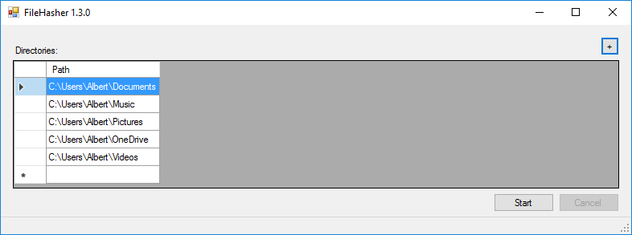
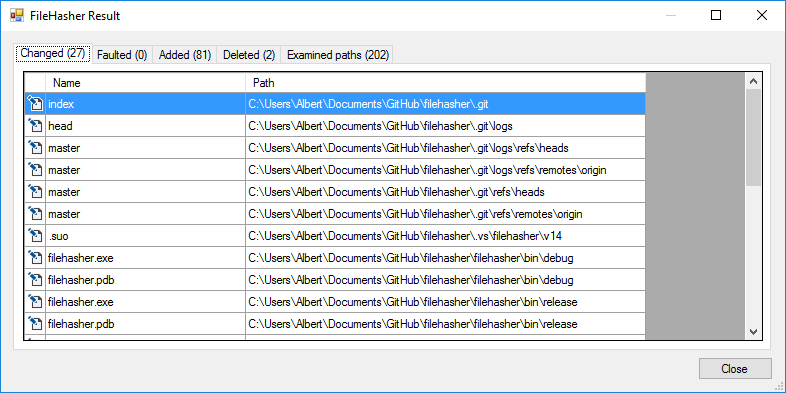

# FileHasher
Check the file integrity in your file system.

## Use

First you need to configure the directories (1) that should be checked.
With the plus button (2) you can add additional directories. Press the start
button to begin with the initial integrity scan.

During the scan process you can see the currently scanned directory (1). The
scan process can be stopped at any time with the cancel button.

After the scan process has finished, the result view opens. In the top of the
window (1) you can see how many files are changed and how many files can not
be checked...

