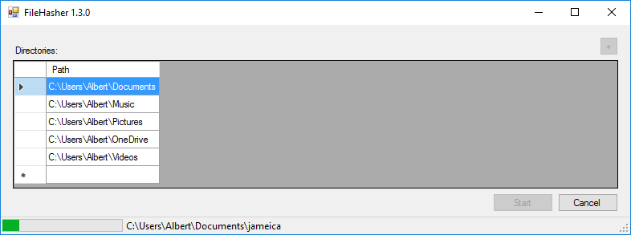

# FileHasher
Check the file integrity in your file system.

## Installation

Use the XCOPY deployment to install the application to a directory you like.
The application database is located in the directory "%appdata%\FileHasher".

## Use

First you need to configure the directories that should be checked.
There exist two options to add additional directories:

- Press the plus button and select an directory with the folder browse dialog.
- Click into the row with the star and enter a valid directory path.

To delete a listed directory select the row and press the delete key on the
keyboard.

Press the start button to begin with the (initial) integrity scan.

During the scan process you can see the currently scanned directory in the
status bar. The scan process can be stopped at any time with the cancel button.

After the scan process has finished, the result view opens.
The result is grouped in several categories.
In each category is a detailed list of the affected items.

